# 极简版抖音架构设计
## 场景分析
## 整体架构设计
## 技术选型
文件上传oss
## 数据库、中间件设计
## 各个接口 http rpc
### Mysql设计
### Redis设计
#### 1.用户service
##### 1.记录用户登录次数
**数据结构：string**
**key命名规范：user_login_count:user_id**
**过期时间：一周**

##### 2.活跃者列表 定时任务
**数据结构：set**
**key命名规范：active_users_id**
##### 3.大V列表
**数据结构：set**
**key命名规范：usersV_id**

##### 4.消息活跃用户列表 定时任务
**数据结构：string**
**key:user_id scorce:0.5×get+0.5×post**
**key命名规范：commitV_info:video_id**

##### 5.记录大V的用户信息
**数据结构：string**
**key命名规范：userV_info:user_id**
##### 6.记录活跃用户的用户信息 定时任务
**数据结构：string**
**key命名规范：user_active_info:user_id**

##### 7.记录大V关注的用户信息
**数据结构：hash**
**key命名规范：userV_follow_info:user_id**
##### 8.记录活跃用户关注的用户信息
**数据结构：hash**
**key命名规范：userV_follow_info:user_id**

##### 9.记录大V的粉丝信息
**数据结构：hash**
**key命名规范：userV_follower_info:user_id**
##### 10.记录活跃用户的粉丝信息
**数据结构：hash**
**key命名规范：userV_follower_info:user_id**

##### 11.最近登录次数多的列表

#### 2.视频service

##### 1.记录最新发布的300个视频
**数据结构：list**
**key命名规范：video_list**

##### 2.记录用户发布视频数
**数据结构：string**
**key命名规范：user_video_count:user_id**

##### 3.记录大V发布的视频信息
**数据结构：hash**
**key命名规范：videoV_info:user_id**
##### 4.记录活跃者用户发布的视频信息
**数据结构：hash**
**key命名规范：active_users:user_id**

##### 5.记录大V喜欢的视频信息
**数据结构：hash**
**key命名规范：videoV_info_favorite:user_id**
##### 6.记录活跃者喜欢的视频信息
**数据结构：hash**
**key命名规范：active_users_favorite:user_id**

##### 7.记录所有大V发布的视频id
**数据结构：set**
**key命名规范：videoV_info_favorite:user_id**
##### 8.记录所有活跃者发布的视频id
**数据结构：set**
**key命名规范：active_users_favorite:user_id**

#### 3.评论service
##### 1.记录视频评论数
**数据结构：string**
**key命名规范：video_commit_count:video_id**
##### 2.记录大V发布的视频的评论信息
**数据结构：hash**
**key命名规范：commitV_info:video_id**

#### 4.点赞service
##### 1.记录视频点赞数
**数据结构：string**
**key命名规范：video_favorite_count:video_id**
##### 2.记录用户点赞视频数
**数据结构：string**
**key命名规范：user_favorite_video:user_id**

#### 5.关注service
##### 1.记录用户关注数
**数据结构：string**
**key命名规范：user_follow_count:user_id**
##### 2.记录用户粉丝数
**数据结构：string**
**key命名规范：user_follower_count:user_id**

#### 6.消息service
##### 1.统计用户消息次数 只缓存前百分之一 所以用zscore
**数据结构：zset**
**key:user_id scorce:0.5×get+0.5×post**
**key命名规范：commitV_info:video_id**
##### 2.消息活跃用户的消息
**数据结构：string**
**key:user_id value:用户消息**

##### 3.用户消息get次数
**数据结构：string**
**key:user_id value:用户消息**
##### 4.用户消息post次数
**数据结构：string**
**key:user_id value:用户消息**

### RocketMQ设计
#### 1.用户点赞
#### 2.用户关注
#### 3.用户发消息

## 接口设计
### 用户相关接口
#### 1.用户注册接口
**服务链路**
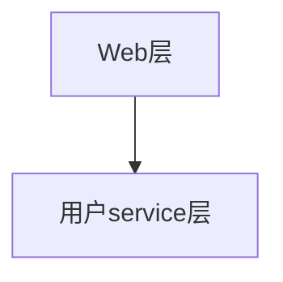
**流程**
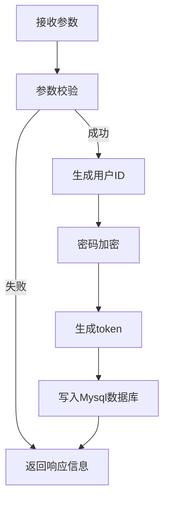
#### 2.用户登录接口

**流程**
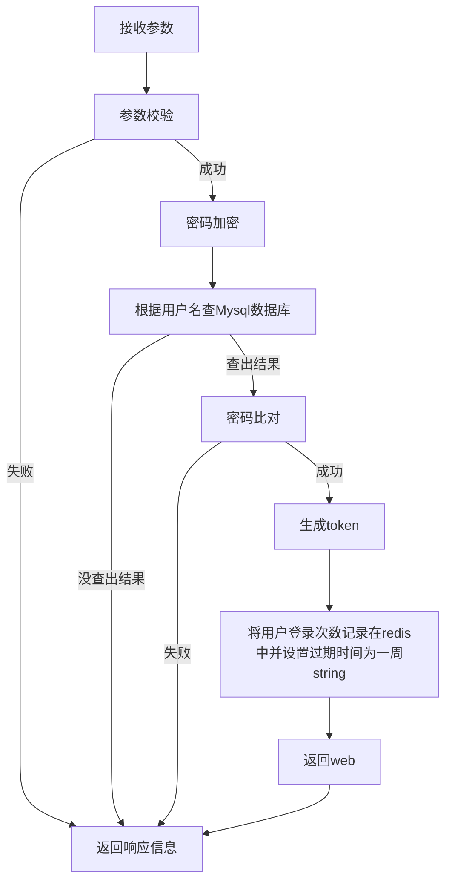
#### 3.用户信息接口
**服务链路**
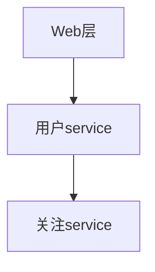
**is_follow:
0-登录用户没有关注请求用户
1-登录用户关注请求用户
2-登录用户不知道是否关注了请求用户，需要后续到关注表中查**

**is_V:
true-是
false-不是**
**流程**
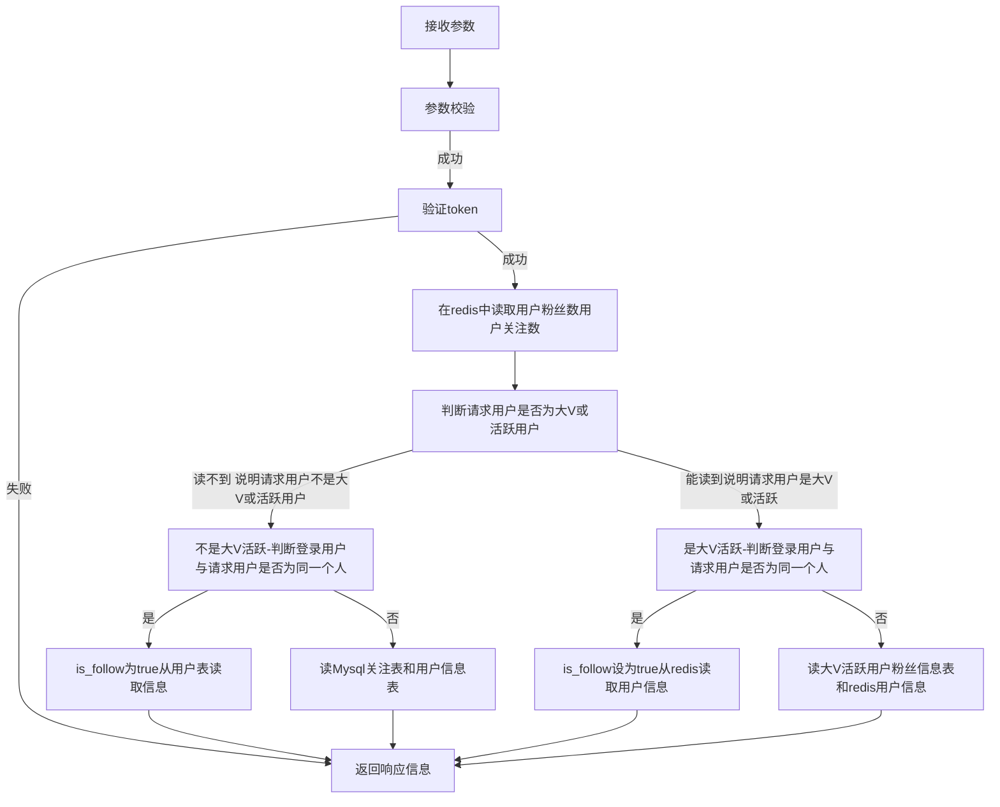
### 视频相关接口
#### 1.视频流接口
**服务链路**
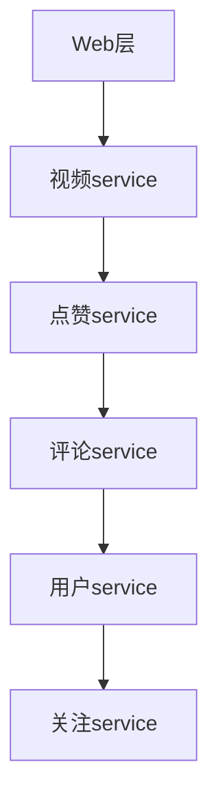
**流程**
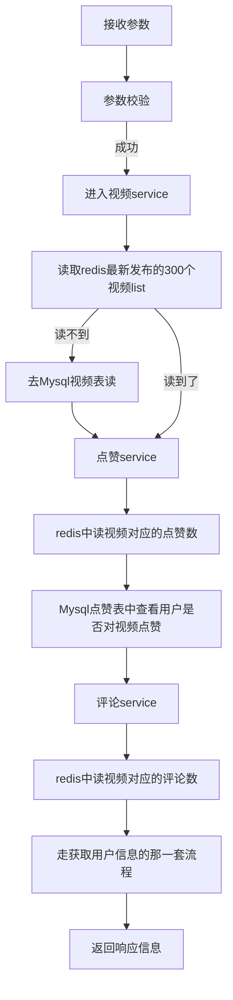
#### 2.发布列表 登录用户的视频发布列表
**服务链路**
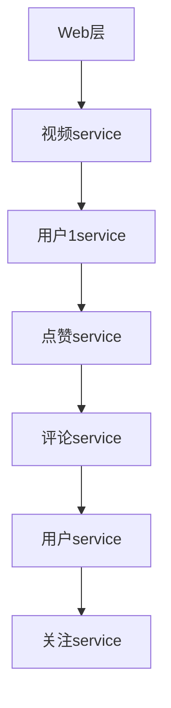
**流程**
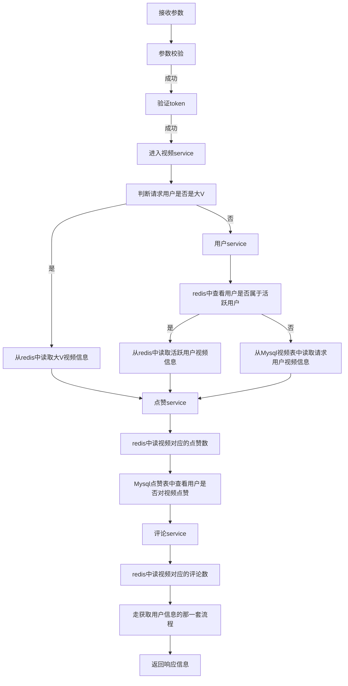
#### 3.视频投稿
**服务链路**
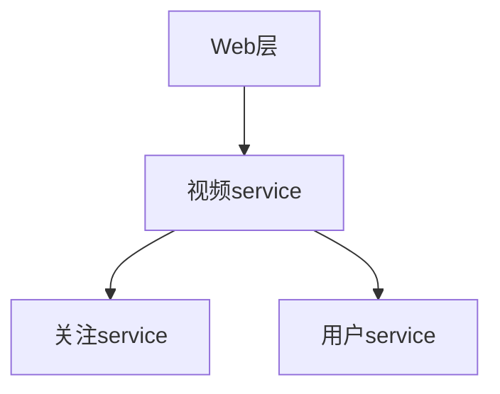
**流程**
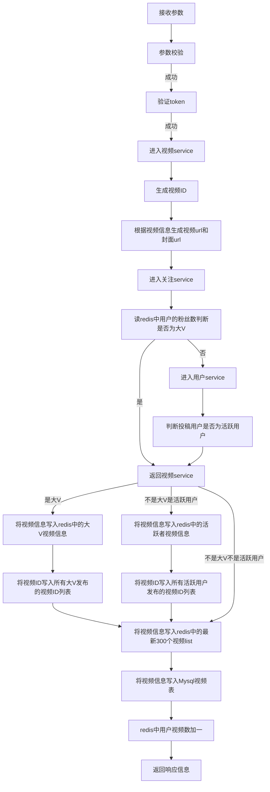
### 点赞相关接口
#### 1.赞操作
**服务链路**
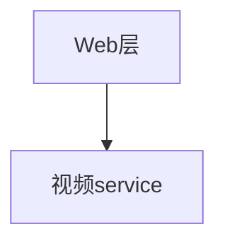
**流程**
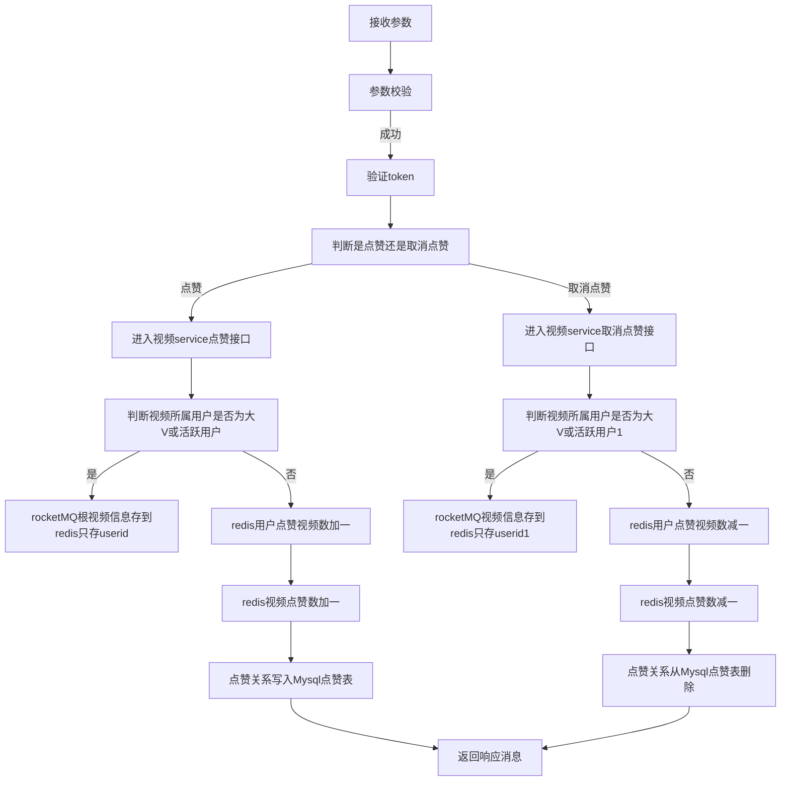
#### 2.喜欢列表 登录用户的所有点赞视频
**服务链路**

**流程**
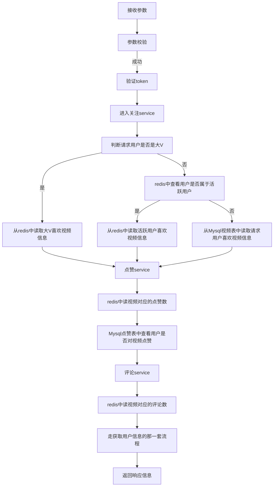
### 评论相关接口
#### 1.评论操作
**服务链路**
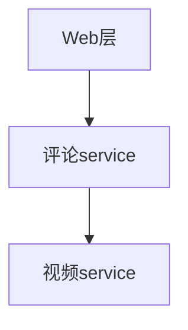
**流程**
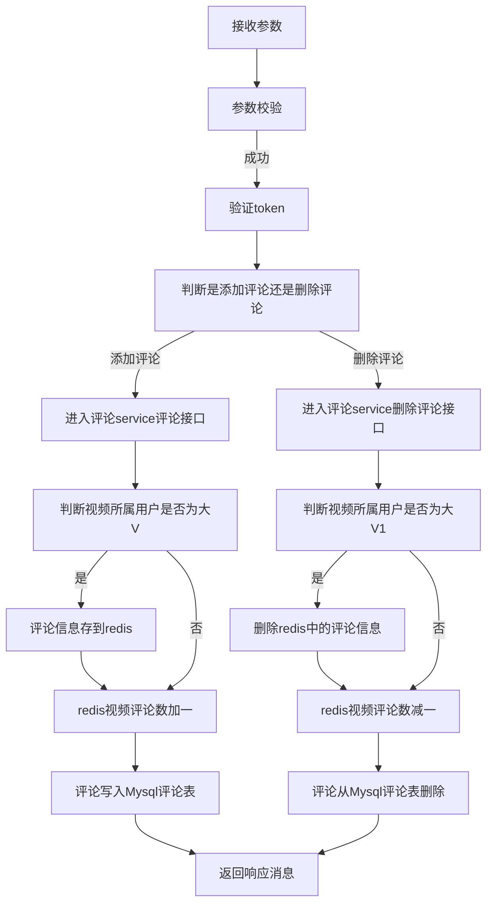
#### 2.视频评论列表
**服务链路**

**流程**
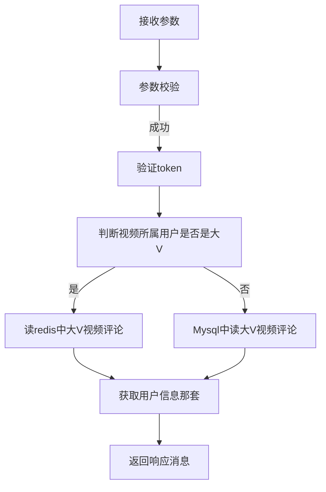
### 关注相关接口
#### 1.关系操作
**服务链路**
```mermaid
graph TD;
    Web层-->评论service;
    评论service-->视频service
```
**流程**
```mermaid
graph TD;
    接收参数-->参数校验;
    参数校验--成功-->验证token
    验证token-->判断是关注还是取消关注
    判断是关注还是取消关注--关注-->判断主动关注的用户是否为大V或活跃用户
    判断主动关注的用户是否为大V或活跃用户--是-->从Mysql用户表读取被关注者的用户信息到大V活跃关注者信息redis
    从Mysql用户表读取被关注者的用户信息到大V活跃关注者信息redis-->进入关注service关注接口
    判断主动关注的用户是否为大V或活跃用户--否-->进入关注service关注接口
    进入关注service关注接口-->判断关注用户是否为大V或活跃用户
     判断关注用户是否为大V或活跃用户--是-->rocketMQredis大V活跃用户粉丝信息
    判断关注用户是否为大V或活跃用户--否-->redis用户关注数加一
    redis用户关注数加一-->redis用户粉丝数加一
    redis用户粉丝数加一-->关注关系写入Mysql关注表
    关注关系写入Mysql关注表-->返回响应消息
    判断是关注还是取消关注--取消关注-->判断取消关注的用户是否为大V或活跃用户
    判断取消关注的用户是否为大V或活跃用户--是-->删除大V活跃关注者信息redis对应列
    删除大V活跃关注者信息redis对应列-->进入关注service取消关注接口
    判断取消关注的用户是否为大V或活跃用户--否-->进入关注service取消关注接口
    进入关注service取消关注接口-->判断关注用户是否为大V活跃用户1
    判断关注用户是否为大V活跃用户1--是-->rocketMQ删redis大V活跃粉丝I信息
    判断关注用户是否为大V活跃用户1--否-->redis用户关注数减一
    redis用户关注数减一-->redis用户粉丝数减一
    redis用户粉丝数减一-->关注关系从Mysql关注表删除
    关注关系从Mysql关注表删除-->返回响应消息
```
#### 2.用户关注列表
**服务链路**
```mermaid
graph TD;
    Web层-->评论service;
    评论service-->视频service
```
**流程**
```mermaid
graph TD;
    接收参数-->参数校验;
    参数校验--成功-->验证token
    验证token-->判断用户是否为大V或活跃用户
    判断用户是否为大V或活跃用户--是-->从redis中读
    从redis中读-->获取用户其它信息那一套
    获取用户其它信息那一套-->返回响应信息
    判断用户是否为大V或活跃用户--否-->从mysql读
    从mysql读-->获取用户其它信息那一套
```
#### 3.用户粉丝列表
**服务链路**
```mermaid
graph TD;
    Web层-->评论service;
    评论service-->视频service
```
**流程**
```mermaid
graph TD;
    接收参数-->参数校验;
    参数校验--成功-->验证token
    验证token-->判断用户是否为大V或活跃用户
    判断用户是否为大V或活跃用户--是-->从redis中读
    从redis中读-->获取用户其它信息那一套
    获取用户其它信息那一套-->返回响应信息
    判断用户是否为大V或活跃用户--否-->从mysql读
    从mysql读-->获取用户其它信息那一套
```
#### 4.用户好友列表
**服务链路**
```mermaid
graph TD;
    Web层-->评论service;
    评论service-->视频service
```
**流程**
```mermaid
graph TD;
    接收参数-->参数校验;
    参数校验--成功-->验证token
    验证token-->判断用户是否为大V或活跃用户
    判断用户是否为大V或活跃用户--是-->从redis中读
    从redis中读-->获取用户其它信息那一套
    获取用户其它信息那一套-->返回响应信息
    判断用户是否为大V或活跃用户--否-->从mysql读
    从mysql读-->获取用户其它信息那一套
```
### 消息相关接口
#### 1.消息操作
**服务链路**
```mermaid
graph TD;
    Web层-->消息service;
```
**流程**
```mermaid
graph TD;
    接收参数-->参数校验;
    参数校验--成功-->验证token
    验证token-->消息service
    消息service-->查看用户是否是消息活跃用户
    查看用户是否是消息活跃用户--是-->存入活跃用户消息redis
    存入活跃用户消息redis-->rocketMQ存入Mysql消息表
    rocketMQ存入Mysql消息表-->返回响应信息
    查看用户是否是消息活跃用户--否-->存入Mysql消息表
    存入Mysql消息表-->返回响应信息
```
#### 2.聊天记录
**服务链路**
```mermaid
graph TD;
    Web层-->消息service;
```
**流程**
```mermaid
graph TD;
    接收参数-->参数校验;
    参数校验--成功-->验证token
    验证token-->消息service
    消息service-->查看用户是否是消息活跃用户
    查看用户是否是消息活跃用户--是-->从redis中读消息
    从redis中读消息-->返回响应信息
    查看用户是否是消息活跃用户--否-->从Mysql中读消息
    从Mysql中读消息-->返回响应信息
```
## 代码示例，环境、中间件等配置
## 性能优化 不足之处
当活跃用户的粉丝数到20时，会自动升级为大V，这时候要删除在活跃用户中存的各种信息，若在判断用户是否为活跃用户、执行后续逻辑之前（如获取活跃用户信息）恰好删除，可能会读不到信息、报错